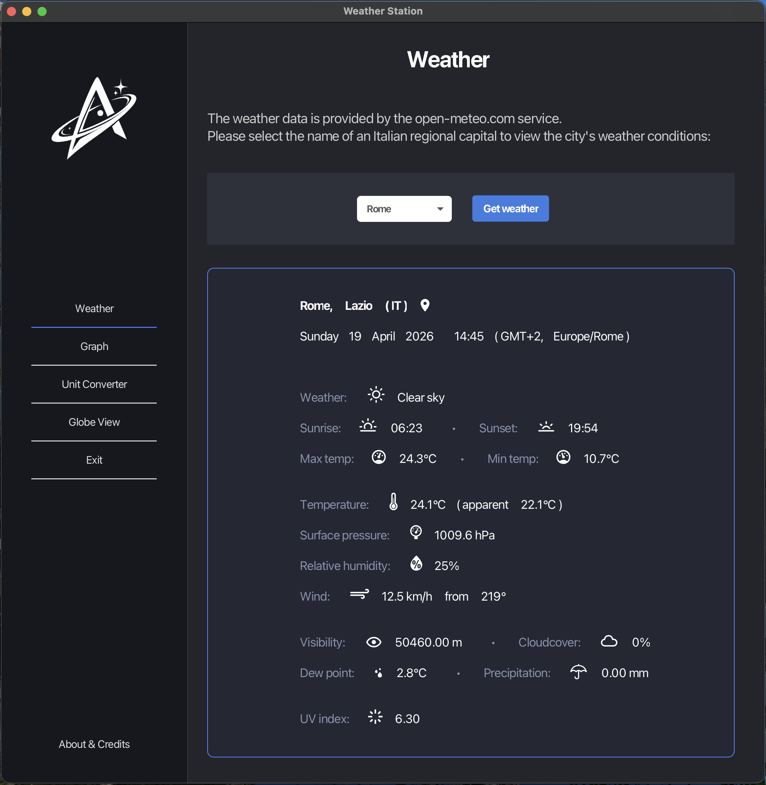
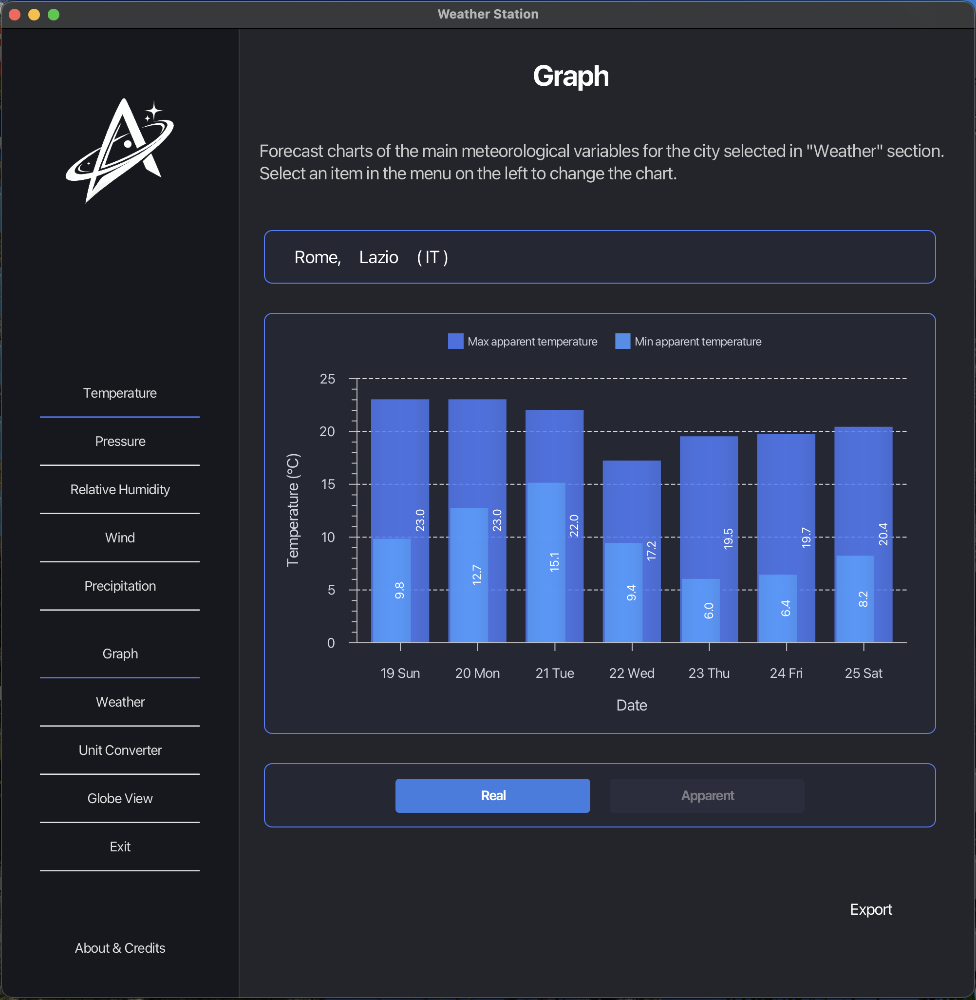
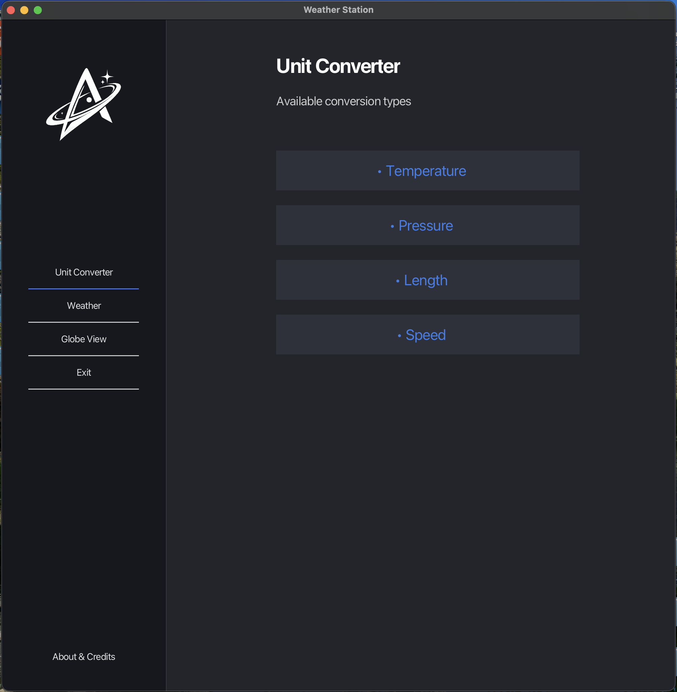
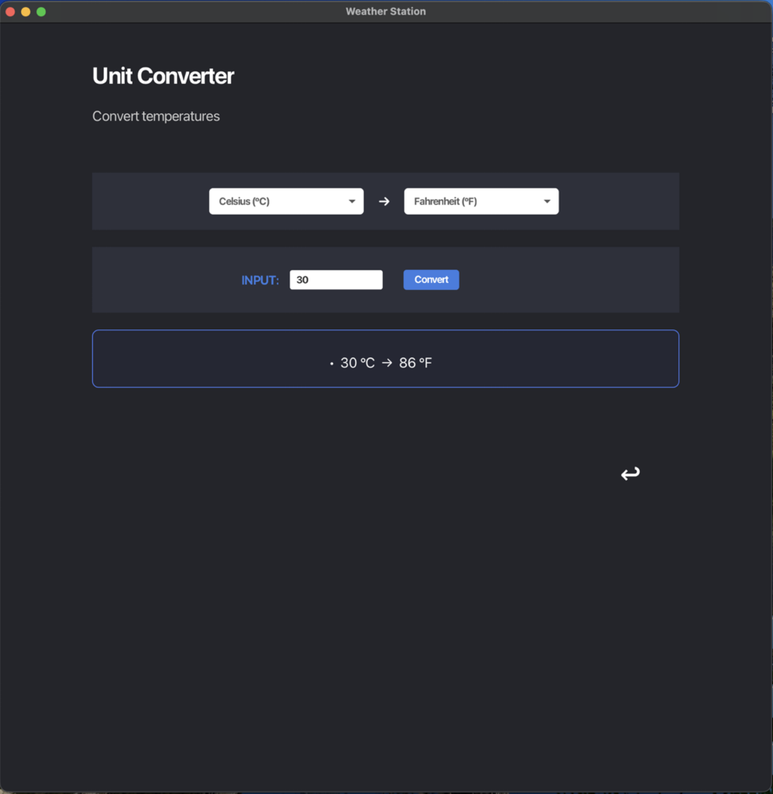
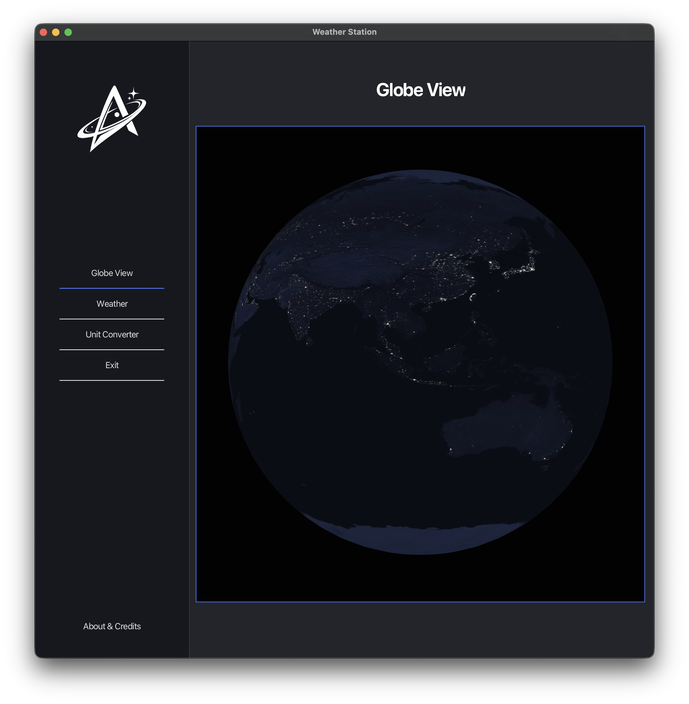

# Weather Station 1.2

Weather Station 1.2 is a non-commercial macOS desktop application developed by Alessio Severi as a portfolio project.
It shows current weather conditions and 7-day weather forecasts for Italian regional capitals, with a textual weather report, a unit converter for common meteorological quantities, a set of interactive charts that can be exported as PNG images, and a simple 3D globe view.

For a detailed technical description and documentation, visit: [chorax.it](https://chorax.it)

## Screenshots

  
    
  
    
  
    
  
    
  

 

More screenshots available in the [screenshots](screenshots/) folder.

## Author

Application design, logo and source code — © 2026 Alessio Severi.
Source code released under the GNU General Public License v3.0.
See the [LICENSE](LICENSE) file for details.

Third-party components and attribution details are listed in the [THIRD-PARTY-NOTICES](THIRD-PARTY-NOTICES.md) file.

## Services

Weather data provided by [open-meteo.com](https://open-meteo.com), a free public weather API, used in accordance with its terms of service.

## Other credits

- Night earth 2D texture based on Natural Earth III by Tom Patterson (shadedrelief.com), a public domain dataset, used under the terms of its original license.
- Weather icons from Weathericons and Materialdesign2 via the Ikonli icon library, used under the terms of their original licenses.
